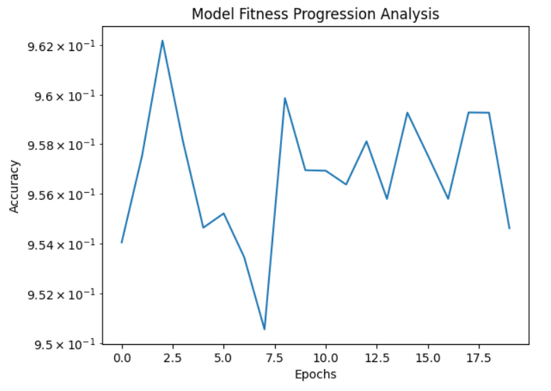

# DFO-BP-Hybrid-Implementation

> <i>Welcome to DFO_BP:  
> A novel hybrid implementation of swarm intelligence algorithm (Dispersive Flies Optimisation) and back-propagation to improve phishing website detection.</i>  
>
> Project Supervisors - Dr Mohammad Majid Al-Rifaie and Dr Hooman Oroojeni Mohamad Javad

<h3>Disclaimer</h3>

This project is a <i>novel</i> approach in the respective field with multiple authors having proposed thier own solutions.   
It has been designed and developed through detailed and 
exhaustive research in the field of swarm intelligence and machine learning.
It was submitted in the form of a Final Year Project for the BSc Hons Computer Science (AI) course.
This piece of work remains as a submitted coursework designed by the author and hence should not be copied as an original work for other fields, including but not limited to the academics. 
Please feel free to contact the author should you have any queries about the accuracy or any other details.

<h3>Preface</h3>

With numerous studies having employed multiple novel approaches to address the detection of phishing websites, this project employs a novel hybrid approach which attempts to work on the magnitude of the parameters and establish a foundation to describe the dependency of the neural network model with its parameter magnitudes.
It further evaluates the proposed novel hybrid approach by employing multiple metrics and compares it with past research to identify the grounds for improvements and establish its potential through an in-depth analysis of the model performance.

<h3>Acknowledgement</h3>
I am extremely grateful to all the authors who have imparted their brilliance in contributing to the growth of this field which has formed a basis for the implementation of this experiment. This research
could not have been possible without the constant support of my academic supervisors. I would like to thank all my tutors who have helped me in the formation of this research. It is
only because of the constant learning process incorporated through the years along with the extreme support extended by the supervisors, that I have been able to achieve this result.

<h3>Results</h3>

  
  
  
  

<h3 align="center">Neural Network DFO model and metric comparison**</h3>
 

  
  
  
  

<h3 align="center">Neural Network DFO_BP Hybrid model and metric comparison</h3>

<h3>Conclusion</h3>
The basis of the implementation of the proposed hybrid approach was the assumption that it could deliver far superior outcomes not just against the DFO implementation, but also other prominent heuristic methods employed in the past which have addressed the detection of phishing websites. The proposed approach model (DFO BP) attempted to optimise the performance of the neural network by implementing a hybrid of the gradient-free and gradient-based methods. The gradient-free method implemented was the Dispersive Flies Optimisation algorithm which is a swarm intelligence
algorithm and the gradient-based approach considered was the backpropagation. The employed hybrid algorithm not only outperformed the alternative approach (DFO implementation) but also some of the past employed methods.

<h3>Citations</h3>

> Here are few of the many citations...
1. https://link.springer.com/chapter/10.1007/978-3-030-12767-1_5  
2. https://ieeexplore.ieee.org/abstract/document/9655851  
3. https://ieeexplore.ieee.org/abstract/document/6933060  
4. https://www.worldscientific.com/doi/abs/10.1142/S021821301960008X  
5. https://dl.acm.org/doi/abs/10.1145/3227609.3227655  
